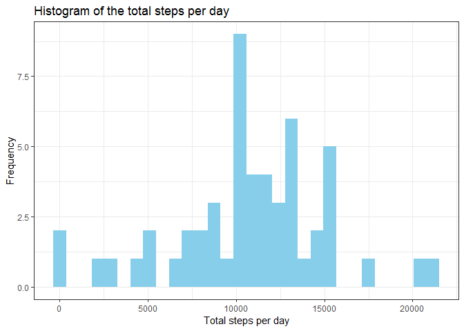
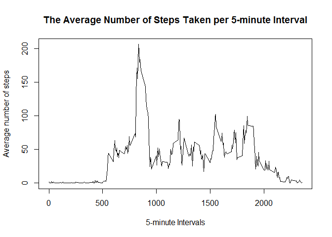
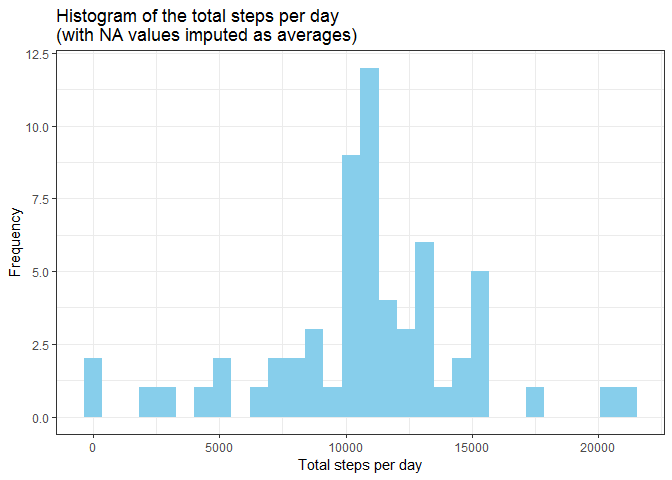
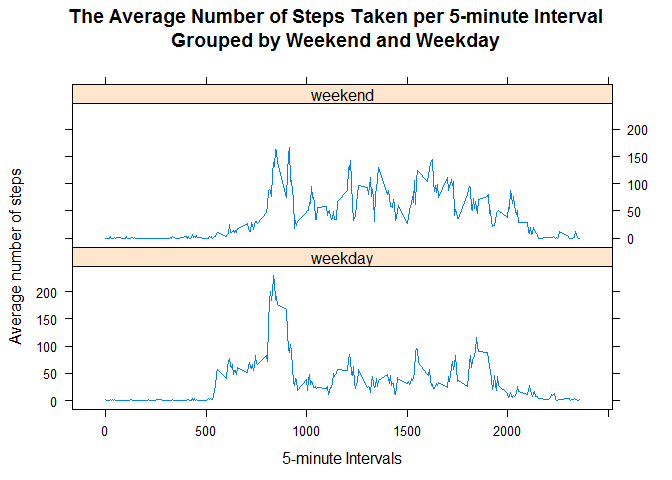

## Loading and preprocessing the data


```r
## Set up dataset
setwd("P:\\David\\data_science_course\\C5_PA1_Reproducible_Research")

activity <- read.csv("activity.csv")

## Check where the NA values are
table(is.na(activity$steps), activity$date)
```

```
##        
##         2012-10-01 2012-10-02 2012-10-03 2012-10-04 2012-10-05 2012-10-06
##   FALSE          0        288        288        288        288        288
##   TRUE         288          0          0          0          0          0
##        
##         2012-10-07 2012-10-08 2012-10-09 2012-10-10 2012-10-11 2012-10-12
##   FALSE        288          0        288        288        288        288
##   TRUE           0        288          0          0          0          0
##        
##         2012-10-13 2012-10-14 2012-10-15 2012-10-16 2012-10-17 2012-10-18
##   FALSE        288        288        288        288        288        288
##   TRUE           0          0          0          0          0          0
##        
##         2012-10-19 2012-10-20 2012-10-21 2012-10-22 2012-10-23 2012-10-24
##   FALSE        288        288        288        288        288        288
##   TRUE           0          0          0          0          0          0
##        
##         2012-10-25 2012-10-26 2012-10-27 2012-10-28 2012-10-29 2012-10-30
##   FALSE        288        288        288        288        288        288
##   TRUE           0          0          0          0          0          0
##        
##         2012-10-31 2012-11-01 2012-11-02 2012-11-03 2012-11-04 2012-11-05
##   FALSE        288          0        288        288          0        288
##   TRUE           0        288          0          0        288          0
##        
##         2012-11-06 2012-11-07 2012-11-08 2012-11-09 2012-11-10 2012-11-11
##   FALSE        288        288        288          0          0        288
##   TRUE           0          0          0        288        288          0
##        
##         2012-11-12 2012-11-13 2012-11-14 2012-11-15 2012-11-16 2012-11-17
##   FALSE        288        288          0        288        288        288
##   TRUE           0          0        288          0          0          0
##        
##         2012-11-18 2012-11-19 2012-11-20 2012-11-21 2012-11-22 2012-11-23
##   FALSE        288        288        288        288        288        288
##   TRUE           0          0          0          0          0          0
##        
##         2012-11-24 2012-11-25 2012-11-26 2012-11-27 2012-11-28 2012-11-29
##   FALSE        288        288        288        288        288        288
##   TRUE           0          0          0          0          0          0
##        
##         2012-11-30
##   FALSE          0
##   TRUE         288
```

```r
## It seems that if there are missing values, the entire days values are missing. Remove these days.
activity_noNA <- activity[-which(is.na(activity$steps)),]

## Remove the dates with no values
activity_noNA$date <- droplevels(activity_noNA$date)

## 8 dates were removed from the dataset
length(levels(activity$date)); length(levels(activity_noNA$date))
```

```
## [1] 61
```

```
## [1] 53
```

## What is mean total number of steps taken per day?


```r
## Transform the data to a ggplot2 compatible format
library(reshape2)
```

```
## Warning: package 'reshape2' was built under R version 3.5.2
```

```r
### Count the number of steps taken for each available day
steps_per_day <- tapply(activity_noNA$steps, activity_noNA$date, sum)
steps_per_day_plot <- melt(steps_per_day)
colnames(steps_per_day_plot) <- c("Date", "Total_steps")
head(steps_per_day_plot)
```

```
##         Date Total_steps
## 1 2012-10-02         126
## 2 2012-10-03       11352
## 3 2012-10-04       12116
## 4 2012-10-05       13294
## 5 2012-10-06       15420
## 6 2012-10-07       11015
```

```r
## Create the plot with ggplot2
library(ggplot2)
```

```
## Warning: package 'ggplot2' was built under R version 3.5.2
```

```r
plot1 <- ggplot(data = steps_per_day_plot, aes(x = Total_steps)) +
    geom_histogram(fill = "skyblue") + 
    ggtitle("Histogram of the total steps per day") +
    xlab("Total steps per day") +
    ylab("Frequency") +
    theme_bw()

plot1
```

```
## `stat_bin()` using `bins = 30`. Pick better value with `binwidth`.
```

<!-- -->

```r
## Mean steps
mean(steps_per_day_plot$Total_steps)
```

```
## [1] 10766.19
```

```r
## Median steps
median(steps_per_day_plot$Total_steps)
```

```
## [1] 10765
```

## What is the average daily activity pattern?


```r
## Create a time series object from the data
average_steps_by_interval <- aggregate(steps ~ interval, data = activity_noNA, mean)
plot(x = average_steps_by_interval$interval, y = average_steps_by_interval$steps, 
     type = "l", 
     main = "The Average Number of Steps Taken per 5-minute Interval",
     xlab = "5-minute Intervals",
     ylab = "Average number of steps")
```

<!-- -->

## Imputing missing values


```r
## Total numbers of NA values for the "steps" variable in the dataset
sum(is.na(activity$steps) == TRUE)
```

```
## [1] 2304
```

```r
## Impute the missing values with the average from the dataset for that interval

### Create a duplicate copy of activity for editing
activity_imp <- activity

### Loop over each row of the dataset, changing any NA step values to the average for that interval
for ( row_num in 1:nrow(activity))  {
    row <- activity[row_num,]
    if ( is.na(row$steps) ) {
      avg <- average_steps_by_interval$steps[ average_steps_by_interval$interval == row$interval ]
      ## Overwrite the NA value with the average for that time interval
      activity_imp[row_num,1] <- avg
    } 
}

## Create a histogram of the total number of steps per day in the imputed dataset
### Transform the data to a ggplot2 compatible format
library(reshape2)
#### Count the number of steps taken for each available day
steps_per_day_imp <- tapply(activity_imp$steps, activity_imp$date, sum)
steps_per_day_plot_imp <- melt(steps_per_day_imp)
colnames(steps_per_day_plot_imp) <- c("Date", "Total_steps")

## Create the plot with ggplot2
library(ggplot2)
plot1 <- ggplot(data = steps_per_day_plot_imp, aes(x = Total_steps)) +
    geom_histogram(fill = "skyblue") + 
    ggtitle("Histogram of the total steps per day\n(with NA values imputed as averages)") +
    xlab("Total steps per day") +
    ylab("Frequency") +
    theme_bw()

plot1
```

```
## `stat_bin()` using `bins = 30`. Pick better value with `binwidth`.
```

<!-- -->

```r
## Output mean and median comparison as a table
table1 <- 
  data.frame(
    mean = c(mean(steps_per_day_plot$Total_steps), mean(steps_per_day_plot_imp$Total_steps)),
    median = c(median(steps_per_day_plot$Total_steps), median(steps_per_day_plot_imp$Total_steps)),
    NA_action = c("NAs_removed", "NAs_imputed")
  )
print(table1)
```

```
##       mean   median   NA_action
## 1 10766.19 10765.00 NAs_removed
## 2 10766.19 10766.19 NAs_imputed
```

Imputing the missing values as mean values has no effect on the mean. It however had the effect of increasing the median, suggesting a slight skew in the data. 

## Are there differences in activity patterns between weekdays and weekends?


```r
## Convert the date variable to 'Date' class
activity_imp$date <- as.Date(activity_imp$date)
## Create the weekday variable
activity_imp$weekday <- as.factor(weekdays(activity_imp$date))
activity_imp$weekday <- 
  factor(
    activity_imp$weekday, 
    labels = c("weekday", "weekday", "weekend", "weekend", "weekday", "weekday", "weekday")
  )

## Panel plot of the average steps taken each day by weekday and weekend
library(lattice) 
average_steps_by_interval_2 <- aggregate(steps ~ interval + weekday, data = activity_imp, mean)
attach(average_steps_by_interval_2)
xyplot(steps~interval|weekday, 
     type = "l", 
     main = "The Average Number of Steps Taken per 5-minute Interval\nGrouped by Weekend and Weekday",
     xlab = "5-minute Intervals",
     ylab = "Average number of steps",
     layout=c(1,2))
```

<!-- -->
